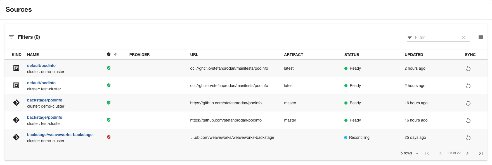

# Flux plugin for Backstage

The Flux plugin for Backstage provides views of [Flux](https://fluxcd.io/) resources available in Kubernetes clusters.



## Content

All cards use the Backstage ["common label"](https://backstage.io/docs/features/kubernetes/configuration#common-backstageiokubernetes-id-label)

All these cards display the relevant resources for the currently displayed entity.

These cards provide unified views of their resources.

- FluxEntityDeploymentsCard - Displays associated Kustomizations and HelmReleases
- FluxEntitySourcesCard - Displays associated GitRepositories, OCIRepositories and HelmRepositories

You can also add specific views for resources with the following Cards.

- FluxEntityHelmReleasesCard
- FluxEntityKustomizationsCard
- FluxEntityGitRepositoriesCard
- FluxEntityOCIRepositoriesCard
- FluxEntityHelmRepositoriesCard

As with other Backstage plugins, you can compose the UI you need.

## Prerequisite

The Kubernetes plugins including `@backstage/plugin-kubernetes` and `@backstage/plugin-kubernetes-backend` are to be installed and configured by following the installation and configuration [guides](https://backstage.io/docs/features/kubernetes/installation/#adding-the-kubernetes-frontend-plugin).

After they are installed, make sure to import the frontend plugin by adding the "Kubernetes" tab wherever needed.
```tsx
// In packages/app/src/components/catalog/EntityPage.tsx
import { EntityKubernetesContent } from '@backstage/plugin-kubernetes';

// You can add the tab to any number of pages, the service page is shown as an example here
const serviceEntityPage = (
  <EntityLayout>
    {/* other tabs... */}
    <EntityLayout.Route path="/kubernetes" title="Kubernetes">
      <EntityKubernetesContent refreshIntervalMs={30000} />
    </EntityLayout.Route>
  </EntityLayout>
);
```

The Kubernetes plugin is configured and connects to the cluster using a ServiceAccount.

You will need to bind the ServiceAccount to the `ClusterRole` `flux-view-flux-system` that is created with these [permissions](https://github.com/fluxcd/flux2/blob/44d69d6fc0c353e79c1bad021a4aca135033bce8/manifests/rbac/view.yaml) by Flux.

```yaml
apiVersion: rbac.authorization.k8s.io/v1
kind: ClusterRoleBinding
metadata:
  name: backstage-cluster-view-rolebinding
roleRef:
  apiGroup: rbac.authorization.k8s.io
  kind: ClusterRole
  name: flux-view-flux-system
subjects:
  - kind: ServiceAccount
    name: backstage # replace with the name of the SA that your Backstage runs as
    namespace: flux-system
```

The "sync" button requires additional permissions, it implements same functionality as [flux reconcile](https://fluxcd.io/flux/cmd/flux_reconcile/) for resources.

```yaml
apiVersion: rbac.authorization.k8s.io/v1
kind: ClusterRole
metadata:
  name: sync-flux-resources
rules:
  - apiGroups:
      - source.toolkit.fluxcd.io
    resources:
      - buckets
      - helmcharts
      - gitrepositories
      - helmrepositories
      - ocirepositories
    verbs:
      - patch
  - apiGroups: 
      - kustomize.toolkit.fluxcd.io
    resources: 
      - kustomizations
    verbs:
      - patch
  - apiGroups:
      - helm.toolkit.fluxcd.io
    resources:
      - helmreleases
    verbs:
      - patch
---
apiVersion: rbac.authorization.k8s.io/v1
kind: ClusterRoleBinding
metadata:
  name: backstage-sync-flux-resources-rolebinding
roleRef:
  apiGroup: rbac.authorization.k8s.io
  kind: ClusterRole
  name: sync-flux-resources
subjects:
  - kind: ServiceAccount
    name: backstage # replace with the name of the SA that your Backstage runs as
    namespace: flux-system
```

## Installation

Install the plugin dependency in your Backstage app package:

```bash
# From your Backstage root directory
yarn add --cwd packages/app @weaveworksoss/backstage-plugin-flux
```

## Configuration

The Flux plugins provide several different Cards, which are composable into your Backstage App.

1. Add the card to your app EntityPage.tsx

```tsx
// In packages/app/src/components/catalog/EntityPage.tsx
import { FluxEntityHelmReleasesCard } from '@weaveworksoss/backstage-plugin-flux';

// You can add the tab to any number of pages, the service page is shown as an
// example here
const overviewContent = (
  <Grid container spacing={3} alignItems="stretch">
    // ...
    <Grid item md={4} xs={12}>
      <FluxEntityHelmReleasesCard />
    </Grid>
    // ...
  </Grid>
);
```

The card has a `many` property which is `true` by default. If your card table is likely to have just a few items, you can switch this to `false` to hide the filtering, searching and pagination options in the card table.

```tsx
<Grid item md={4} xs={12}>
  <FluxEntityHelmReleasesCard many={false} />
</Grid>
```

2. Add a page to your app EntityPage.tsx

```tsx
// In packages/app/src/components/catalog/EntityPage.tsx
import {
  FluxEntityHelmReleasesCard,
  FluxEntityGitRepositoriesCard,
  FluxEntityOCIRepositoriesCard,
  FluxEntityHelmRepositoriesCard,
} from '@weaveworksoss/backstage-plugin-flux';

const serviceEntityPage = (
  <EntityLayout>
    // ...
    <Grid container spacing={3} alignItems="stretch">
      <Grid item md={12}>
        <FluxEntityHelmReleasesCard />
      </Grid>
      <Grid item md={12}>
        <FluxEntityHelmRepositoriesCard />
      </Grid>
      <Grid item md={12}>
        <FluxEntityGitRepositoriesCard />
      </Grid>
      <Grid item md={12}>
        <FluxEntityOCIRepositoriesCard />
      </Grid>
    </Grid>
    // ...
  </EntityLayout>
);
```

3. Add the [backstage.io/kubernetes-id](https://backstage.io/docs/features/kubernetes/configuration/#common-backstageiokubernetes-id-label) to your Backstage entity.

```yaml
apiVersion: backstage.io/v1alpha1
kind: Component
metadata:
  name: carts-service
  description: A microservices-demo service that provides shopping carts for users
  tags:
    - java
  annotations:
    backstage.io/kubernetes-id: carts-service
spec:
  type: service
  lifecycle: production
  owner: sockshop-team
  system: carts
```

4. Label your Flux HelmRelease with the correct label:

```yaml
apiVersion: helm.toolkit.fluxcd.io/v2beta1
kind: HelmRelease
metadata:
  name: carts-nginx
  namespace: carts
  labels:
    backstage.io/kubernetes-id: carts-service
spec:
  chart:
    spec:
      chart: nginx
      reconcileStrategy: ChartVersion
      sourceRef:
        kind: HelmRepository
        name: podinfo
  interval: 1m0s
```

5. [Optional] Configure linking through to Weave GitOps, configure your `app-config.yaml`

If you have [Weave GitOps](https://www.weave.works/product/gitops/) or [Weave GitOps Enterprise](https://www.weave.works/product/gitops-enterprise/) you can configure the plugins to link through to the UI which will provide more information on the resources.

This will generate link URLs through to the relevant UIs relative to the configured URL, for example to view Helm Repositories, this would generate a URL that looks like this `https://wego.example.com/wego/helm_repo/details?clusterName=demo-cluster&name=podinfo&namespace=default`.

```yaml
# app-config.yaml

gitops:
  #
  baseUrl: https://wego.example.com
```
