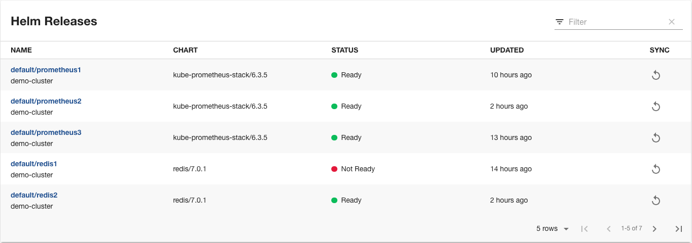

# Flux plugin for Backstage

The Flux plugin for Backstage provides views of [Flux](https://fluxcd.io/) resources available in Kubernetes clusters.



## Content

- FluxEntityHelmReleasesCard - displays the state of HelmReleases for the Entity.

## Prerequisite

The Kubernetes plugins including `@backstage/plugin-kubernetes` and `@backstage/plugin-kubernetes-backend` are installed and configured by following the installation and configuration guides.

The Kubernetes plugin is configured and connects to the cluster using a ServiceAccount.

You will need to bind the ServiceAccount to the `helmrelease-viewer-role` that [comes](https://github.com/fluxcd/helm-controller/blob/main/config/rbac/helmrelease_viewer_role.yaml) with Flux.

```yaml
apiVersion: rbac.authorization.k8s.io/v1
kind: ClusterRoleBinding
metadata:
  name: backstage-cluster-view-rolebinding
roleRef:
  apiGroup: rbac.authorization.k8s.io
  kind: ClusterRole
  name: helmrelease-viewer-role
subjects:
  - kind: ServiceAccount
    name: backstage # replace with the name of the SA that your Backstage runs as
    namespace: flux-system
```

## Installation

Install the plugin dependency in your Backstage app package:

```bash
# From your Backstage root directory
yarn add --cwd packages/app @weaveworksoss/backstage-plugin-flux
```

## Configuration

1. Add the card to your app EntityPage.tsx

```tsx
// In packages/app/src/components/catalog/EntityPage.tsx
import { FluxEntityHelmReleasesCard } from '@weaveworksoss/backstage-plugin-flux';

// You can add the tab to any number of pages, the service page is shown as an
// example here
const overviewContent = (
  <Grid container spacing={3} alignItems="stretch">
    // ...
    <Grid item md={4} xs={12}>
      <FluxEntityHelmReleasesCard />
    </Grid>
    // ...
  </Grid>
);
```

2. Add the card collection to your app EntityPage.tsx

```tsx
// In packages/app/src/components/catalog/EntityPage.tsx
import {
  FluxEntityHelmReleasesCard,
  FluxEntityGitRepositoriesCard,
  FluxEntityOCIRepositoriesCard,
} from '@weaveworksoss/backstage-plugin-flux';

// You can add the tab to any number of pages, the service page is shown as an
// example here
const serviceEntityPage = (
  <EntityLayout>
    // ...
    <Grid container spacing={3} alignItems="stretch">
      <Grid item md={12}>
        <FluxEntityHelmReleasesCard />
      </Grid>
      <Grid item md={12}>
        <FluxEntityGitRepositoriesCard />
      </Grid>
      <Grid item md={12}>
        <FluxEntityOCIRepositoriesCard />
      </Grid>
    </Grid>
    // ...
  </EntityLayout>
);
```

3. Add the [backstage.io/kubernetes-id](https://backstage.io/docs/features/kubernetes/configuration/#common-backstageiokubernetes-id-label) to your Backstage entity.

```yaml
apiVersion: backstage.io/v1alpha1
kind: Component
metadata:
  name: carts-service
  description: A microservices-demo service that provides shopping carts for users
  tags:
    - java
  annotations:
    backstage.io/kubernetes-id: carts-service
spec:
  type: service
  lifecycle: production
  owner: sockshop-team
  system: carts
```

4. Label your Flux HelmRelease with the correct label:

```yaml
apiVersion: helm.toolkit.fluxcd.io/v2beta1
kind: HelmRelease
metadata:
  name: carts-nginx
  namespace: carts
  labels:
    backstage.io/kubernetes-id: carts-service
spec:
  chart:
    spec:
      chart: nginx
      reconcileStrategy: ChartVersion
      sourceRef:
        kind: HelmRepository
        name: podinfo
  interval: 1m0s
```

5. Configure your `app-config.yaml`

```yaml
# app.config.yaml

gitops:
  baseUrl: https://wego.example.com/
```
